# 🌱 Day 1 — Introduction to Terraform & Infrastructure as Code

**Date:** Sunday, 12th July 2026

My own notes from Day 1 — written plain and simple, in the order I actually learned it.

---

## 1. What Is Infrastructure as Code (IaC)?

Infrastructure as Code means describing infrastructure — servers, networks, storage, databases — as configuration files, instead of setting it up manually by clicking through a cloud console.

That configuration file becomes the record of what exists and why — the same way source code is the record of how an application works.

**Problems it solves compared to clicking around a console:**
- **No repeatability** — rebuilding the same setup by hand takes time and is easy to get wrong
- **No version history** — console changes leave no trail of what changed or when
- **No easy review** — there's no simple way to check a change before it goes live

IaC fixes all three: the config can be reused, tracked in Git, and reviewed before anything actually happens.

---

## 2. What Is Terraform?

Terraform is an **Infrastructure as Code tool made by HashiCorp**.

Instead of logging into a cloud console and clicking buttons to create servers, storage, or networks, I write down what I want in a `.tf` file — and Terraform creates it for me automatically.

---

## 3. How Terraform Works — The Core Workflow

```
  Write  ──▶  Init  ──▶  Plan  ──▶  Apply  ──▶  Destroy
  (.tf)     (init)     (preview)   (create)    (clean up)
```

- **Write** — describe the desired infrastructure in `.tf` files
- **Init** — download the provider plugin(s) needed
- **Plan** — preview exactly what will be created/changed/destroyed, before anything happens
- **Apply** — actually create the infrastructure
- **Destroy** — clean it up when no longer needed

---

## 4. Why Terraform Matters

- **Declarative** — I describe *what* I want, not the step-by-step *how*. Terraform figures out the steps.
- **Provider-agnostic** — same tool, same workflow, works across AWS, Azure, GCP, and hundreds of other platforms.
- **Huge ecosystem** — massive library of providers and modules already written and shared by the community.
- **State tracking** — Terraform always knows what it has already created, so it only changes what actually needs to change.

---

## 5. Terraform vs Similar Tools

| Tool | How it compares |
|---|---|
| **OpenTofu** | Open-source fork of Terraform, works almost identically — community-run instead of HashiCorp-owned |
| **Pulumi** | Same IaC idea, but config is written in real programming languages (Python, TypeScript, Go) instead of HCL |
| **CloudFormation** | AWS's own native IaC tool — only works with AWS, no multi-cloud support |
| **Ansible** | A different job entirely — configures software on servers that already exist, rather than creating the infrastructure itself |

---

## 6. Terraform Terminology — Quick Reference

| Term | Meaning | Example |
|---|---|---|
| **Provider** | Plugin that lets Terraform talk to a specific platform | `provider "aws" { region = "eu-west-1" }` |
| **Resource** | The actual thing being created | `resource "aws_instance" "my_server" { ... }` |
| **State** | Terraform's record of what it currently manages, stored in `terraform.tfstate` | Tells Terraform "already exists" vs "needs creating" |
| **Plan** | A preview of exactly what will change, before anything happens | Output of `terraform plan` |
| **HCL** | HashiCorp Configuration Language — the syntax everything is written in | `.tf` files |
| **Module** | A reusable, packaged group of Terraform config | Avoids rewriting the same setup repeatedly |

---

## 7. Installing Terraform

Installed using the [official install guide](https://developer.hashicorp.com/terraform/install), then verified:

```bash
terraform --version
```
```
Terraform v1.15.8
on linux_amd64
+ provider registry.terraform.io/hashicorp/aws v6.58.0
```

Also installed the **HashiCorp Terraform extension** in VS Code for syntax highlighting and autocomplete.

---

## 8. Hands-On Lab 1 — Local Provider (No Cloud Needed)

Started with the `local` provider — no cloud account, no cost, no credentials needed. Good for learning the workflow risk-free.

### 8.1 — Writing `main.tf`

```hcl
resource "local_file" "my_file" {
  filename = "automate.txt"
  content  = " this is automated file created with terraform"
}
```

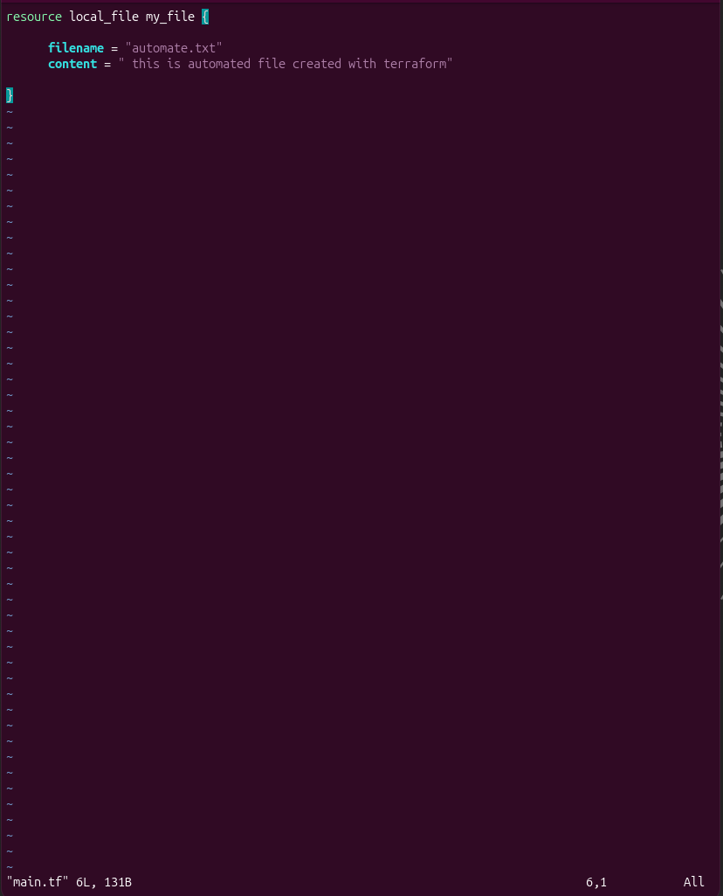

### 8.2 — `terraform init` + `terraform validate`

`init` downloads the `local` provider and sets up the working directory. `validate` checks the config for syntax errors.

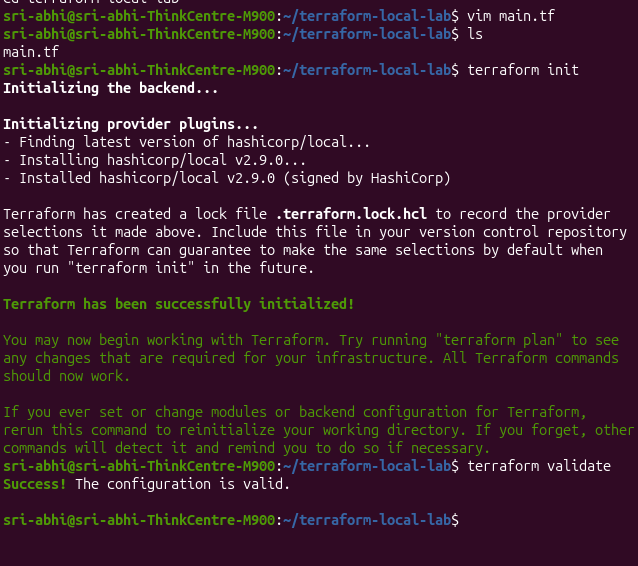

```
Initializing provider plugins...
- Finding latest version of hashicorp/local...
- Installing hashicorp/local v2.9.0...
- Installed hashicorp/local v2.9.0 (signed by HashiCorp)

Terraform has been successfully initialized!

sri-abhi@sri-abhi-ThinkCentre-M900:~/terraform-local-lab$ terraform validate
Success! The configuration is valid.
```

### 8.3 — `terraform plan`

Previews exactly what will happen before anything is actually created — in this case, one file will be added.

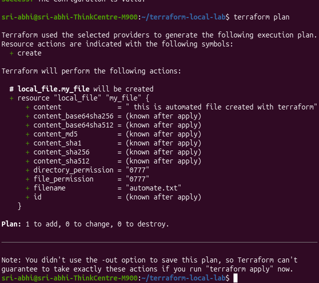

```
Terraform will perform the following actions:

  # local_file.my_file will be created
  + resource "local_file" "my_file" {
      + content  = " this is automated file created with terraform"
      + filename = "automate.txt"
      ...
    }

Plan: 1 to add, 0 to change, 0 to destroy.
```

### 8.4 — `terraform apply`

Confirmed with `yes` — Terraform created the actual file.

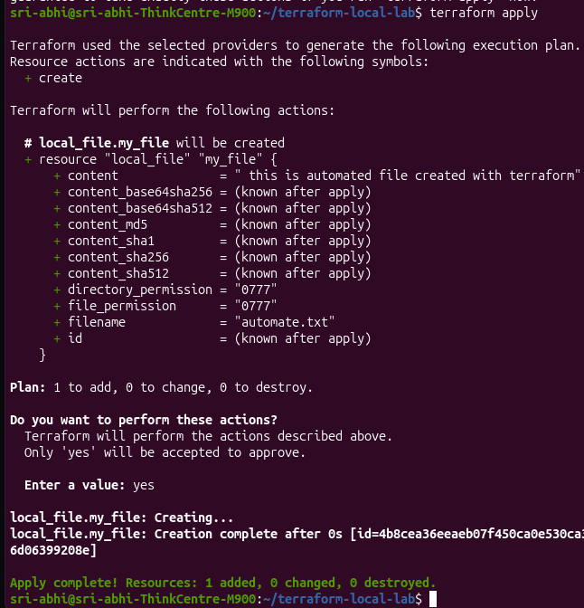

```
Do you want to perform these actions?
  Enter a value: yes

local_file.my_file: Creating...
local_file.my_file: Creation complete after 0s [id=4b8cea36eeaeb07f450ca0e530ca36d06399208e]

Apply complete! Resources: 1 added, 0 changed, 0 destroyed.
```

Verified the file was really created:
```bash
cat automate.txt
```
```
 this is automated file created with terraform
```

### 8.5 — `terraform destroy`

Ran `terraform destroy` and confirmed with `yes` — Terraform removed the exact resource it had created, and nothing else.

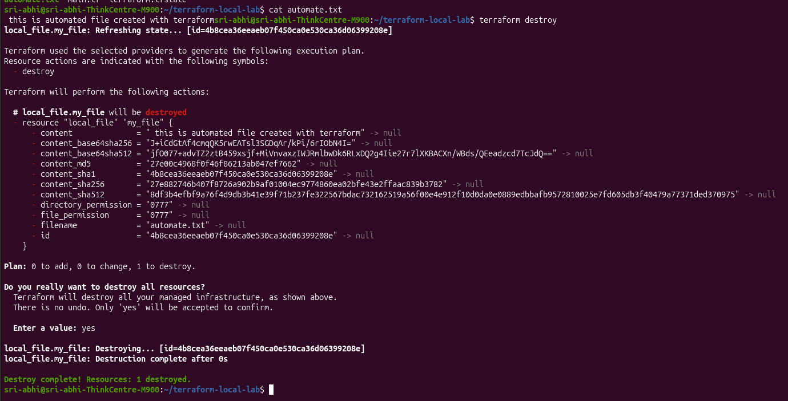

```
Terraform will perform the following actions:

  # local_file.my_file will be destroyed
  - resource "local_file" "my_file" { ... }

Plan: 0 to add, 0 to change, 1 to destroy.

Do you really want to destroy all resources?
  Enter a value: yes

local_file.my_file: Destroying... [id=4b8cea36eeaeb07f450ca0e530ca36d06399208e]
local_file.my_file: Destruction complete after 0s

Destroy complete! Resources: 1 destroyed.
```

**Key takeaway:** the full `init → validate → plan → apply → destroy` cycle worked end to end. Terraform tracked exactly what it created (via `terraform.tfstate`) and cleanly removed only that — nothing happens without an explicit `yes` confirmation at each destructive step.

---

## 9. Hands-On Lab 2 — Setting Up the AWS Provider

### 9.1 — `terraform.tf`

```hcl
terraform {
  required_providers {
    aws = {
      source  = "hashicorp/aws"
      version = "6.58.0"
    }
  }
}

provider "aws" {
  # Configuration options
}
```

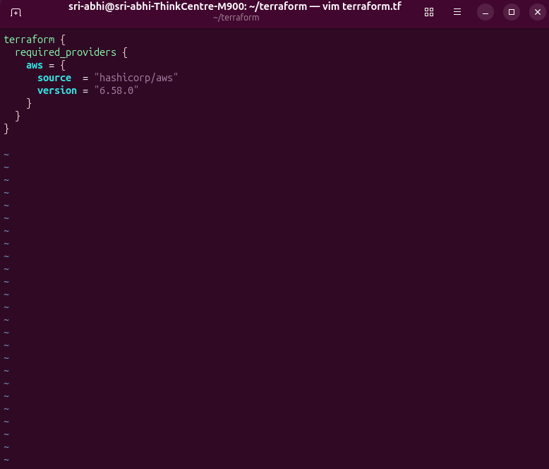

- **`terraform` block** — settings for Terraform itself. `required_providers` tells it which provider plugins this project needs.
  - `source` — where to download the provider from (`hashicorp/aws` = shorthand for `registry.terraform.io/hashicorp/aws`)
  - `version` — pins the exact provider version for consistent behaviour every time
- **`provider "aws"` block** — actually configures the provider (region, credentials, etc.)

### 9.2 — `terraform init` (AWS)

```
Initializing provider plugins...
- Finding hashicorp/aws versions matching "6.58.0"...
- Installing hashicorp/aws v6.58.0...
- Installed hashicorp/aws v6.58.0 (signed by HashiCorp)

Terraform has created a lock file .terraform.lock.hcl to record the provider
selections it made above.

Terraform has been successfully initialized!
```

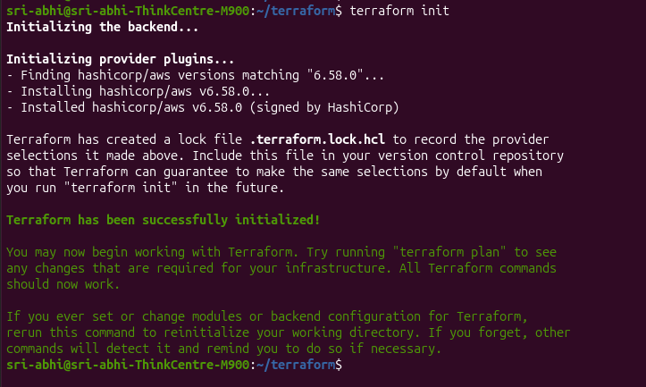

### 9.3 — Understanding the `.terraform/providers/` Folder Structure

When `terraform init` runs, it downloads the provider plugin and stores it in a structured local cache folder:

```
.terraform/providers/registry.terraform.io/hashicorp/aws/6.58.0/linux_amd64/
```

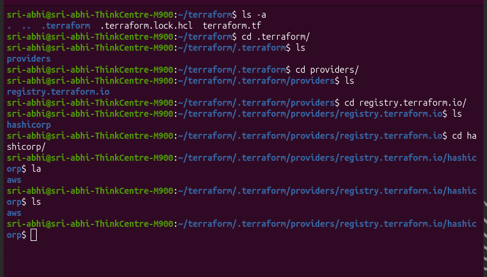

| Folder | What it means |
|---|---|
| `.terraform/` | Terraform's local working directory — created automatically after `init`. Holds provider plugins, module cache, backend state info. **Not committed to git.** |
| `providers/` | Sub-folder specifically for downloaded provider plugins |
| `registry.terraform.io/` | The registry the provider came from — matches the `source` value in `required_providers` |
| `hashicorp/` | The **namespace** — the publisher/organization maintaining the provider |
| `aws/` | The provider name itself |
| `6.58.0/` | The exact version installed, matching what was pinned |
| `linux_amd64/` | The platform/architecture build matched to my machine |

Inside the final folder sits the **actual provider binary** — a compiled executable Terraform runs in the background to make real API calls to AWS. The `linux_amd64/` folder name just tells you *which build* of that binary was downloaded (a Mac M1 would get a `darwin_arm64/` build instead) — it's not a separate thing from "the provider," it *is* the provider.

**Why `.terraform/` is gitignored:**
It's just a local copy of downloaded software — similar to `node_modules/` in JavaScript or `venv/` in Python. It doesn't need to be tracked because it's fully regenerable: anyone who clones the repo and runs `terraform init` gets the exact same folder back, because `.terraform.lock.hcl` (which *is* committed) tells Terraform precisely which version to re-download.

`.gitignore` entry used:
```
.terraform/
*.tfstate
*.tfstate.backup
```

### 9.4 — AWS CLI Installed & Verified

Installed AWS CLI v2 using the official zip installer method (not the piped `curl | bash` shortcut, to avoid running an unreviewed script).

```bash
curl "https://awscli.amazonaws.com/awscli-exe-linux-x86_64.zip" -o "awscliv2.zip"
unzip awscliv2.zip
sudo ./aws/install
aws --version
```

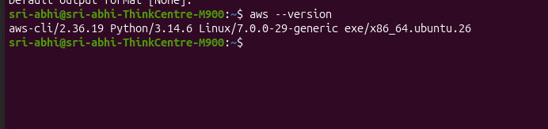

```
aws-cli/2.36.19 Python/3.14.6 Linux/7.0.0-29-generic exe/x86_64.ubuntu.26
```

**IAM user setup (not root):**
Created a dedicated IAM user (`abhiterrauser`) with an access key instead of using root credentials, then ran:
```bash
aws configure
aws sts get-caller-identity
```
```json
{
    "UserId": "AIDAQBKCDSOL3JUSNWFGB",
    "Account": "002823000983",
    "Arn": "arn:aws:iam::002823000983:user/abhiterrauser"
}
```
Confirms the CLI (and therefore Terraform) authenticates as the IAM user, not root — root access keys were deactivated afterward.

### 9.5 — The `.terraform.lock.hcl` File

```bash
cat .terraform.lock.hcl
```

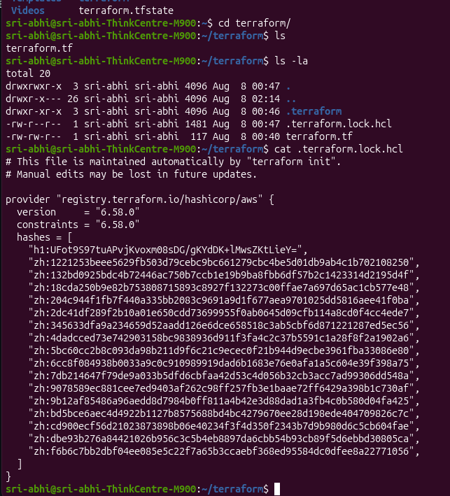

```hcl
# This file is maintained automatically by "terraform init".
# Manual edits may be lost in future updates.

provider "registry.terraform.io/hashicorp/aws" {
  version     = "6.58.0"
  constraints = "6.58.0"
  hashes = [
    "h1:UFot9S97tuAPvjKvoxm08sDG/gKYdDK+lMwsZKtLieY=",
    "zh:1221253beee5629fb503d79cebc9bc661279cbc4be5d01db9ab4c1b702108250",
    ... (additional hashes, one per platform)
  ]
}
```

**What this does:** locks the exact provider version *and* verifies its integrity via checksums (`hashes`). It's small, plain text, and safe to commit — it's the "recipe" that lets `terraform init` recreate the exact same `.terraform/` folder on any machine.

---

## 10. How Terraform Talks to AWS — Step by Step

```
Your .tf files
     ↓
Terraform CLI (reads your config)
     ↓
Provider binary (downloaded during init)
     ↓
AWS API (over the internet)
     ↓
Resource created in AWS account
     ↓
Result saved into terraform.tfstate
```

1. **Write configuration** — `.tf` files describe the desired provider and resources. Just text — nothing happens yet.
2. **`terraform init`** — downloads the AWS provider binary and stores it locally. This binary is the translator that knows how to speak AWS's API language.
3. **`terraform plan`** — Terraform CLI launches the provider binary as a background process. The binary authenticates using AWS credentials (from `aws configure` / env vars) and sends **read-only** API calls ("does this already exist? what's the current state?"). Terraform compares desired config vs AWS's actual state and shows what *would* change — nothing is created yet.
4. **`terraform apply`** — after confirming, the provider binary sends **write** API calls (`CreateBucket`, `RunInstances`, etc.). AWS creates the real resource and returns details (ID, ARN, IP). The provider binary passes this back to Terraform CLI.
5. **State gets recorded** — everything created gets saved into `terraform.tfstate`, which becomes Terraform's memory of what it manages, so future `plan`/`apply` runs know what already exists vs what's new.

**Key point:** Terraform CLI never talks to AWS directly — it always goes through the provider binary, which is the only piece that knows how to construct valid AWS API requests.

---

## 11. Completing the Official TerraWeek Day 1 Example

The TerraWeek challenge's official `day01/example/main.tf` uses two ideas I hadn't covered in my own local-provider lab yet: the **`random`** provider and **`output`** blocks. Ran it separately to close the loop on the actual assignment.

### 11.1 — The config

```hcl
terraform {
  required_version = ">= 1.10"
  required_providers {
    local = {
      source  = "hashicorp/local"
      version = "~> 2.5"
    }
    random = {
      source  = "hashicorp/random"
      version = "~> 3.7"
    }
  }
}

resource "random_pet" "name" {
  length    = 2
  separator = "-"
}

resource "local_file" "greeting" {
  filename = "${path.module}/greeting.txt"
  content  = "Hello from TerraWeek 2026! 🚀\nYour infra pet name is: ${random_pet.name.id}\n"
}

output "pet_name" {
  description = "The randomly generated pet name."
  value       = random_pet.name.id
}

output "file_path" {
  description = "Where the greeting file was written."
  value       = local_file.greeting.filename
}
```

**Two new concepts here:**
- **`random_pet` resource** — generates a random, human-readable name (e.g. `neat-polliwog`). Common in tutorials to demonstrate resource *interpolation* — using one resource's output value inside another resource's config.
- **`output` blocks** — after `apply`, Terraform prints these values in the terminal. Useful for surfacing important info (an IP address, an ID, a generated name) without having to dig through `terraform.tfstate` manually.

Also notice: `local_file.greeting`'s `content` references `random_pet.name.id` — Terraform automatically works out it must create `random_pet` *first*, since `local_file` depends on its output. This is Terraform's **dependency graph** at work — I didn't have to specify the order myself.

### 11.2 — Running it

```bash
cd day01/example
terraform init
```
(Hit a transient network error the first two tries — `read: connection reset by peer` while downloading provider checksums. Retried `terraform init` and it succeeded on the third attempt, reusing what had already downloaded.)

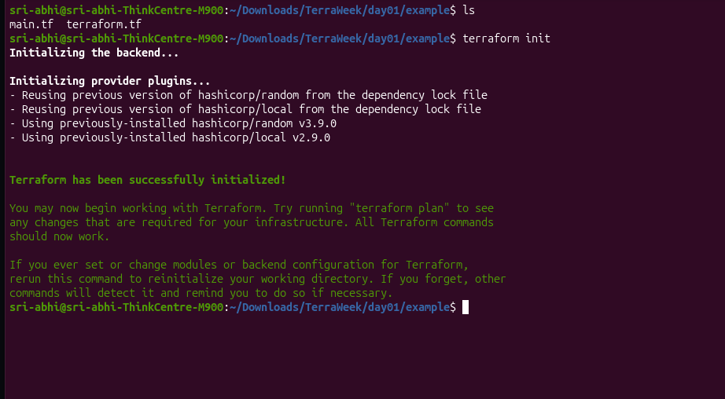

```bash
terraform validate
terraform plan
```

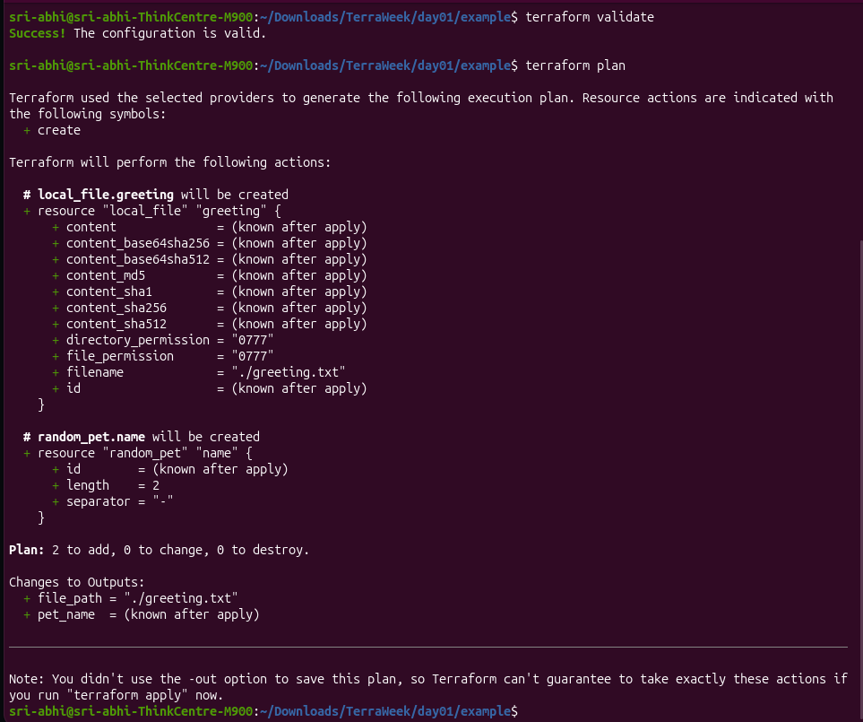

```
Plan: 2 to add, 0 to change, 0 to destroy.

Changes to Outputs:
  + file_path = "./greeting.txt"
  + pet_name  = (known after apply)
```

```bash
terraform apply
```

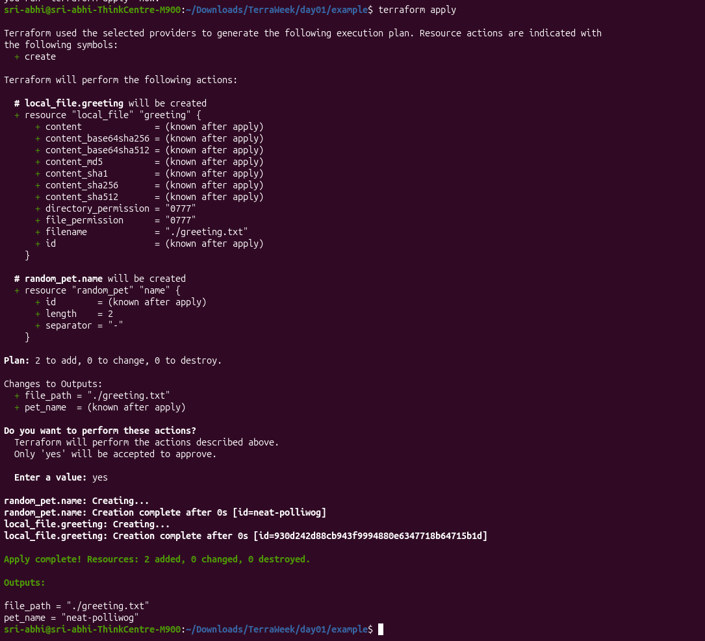

```
Apply complete! Resources: 2 added, 0 changed, 0 destroyed.

Outputs:

file_path = "./greeting.txt"
pet_name = "neat-polliwog"
```

The `Outputs:` block at the end is exactly what the `output` blocks in the config produce — a clean summary printed right after apply, no need to inspect state manually.

```bash
cat greeting.txt
```
```
Hello from TerraWeek 2026! 🚀
Your infra pet name is: neat-polliwog
```

```bash
terraform destroy
```

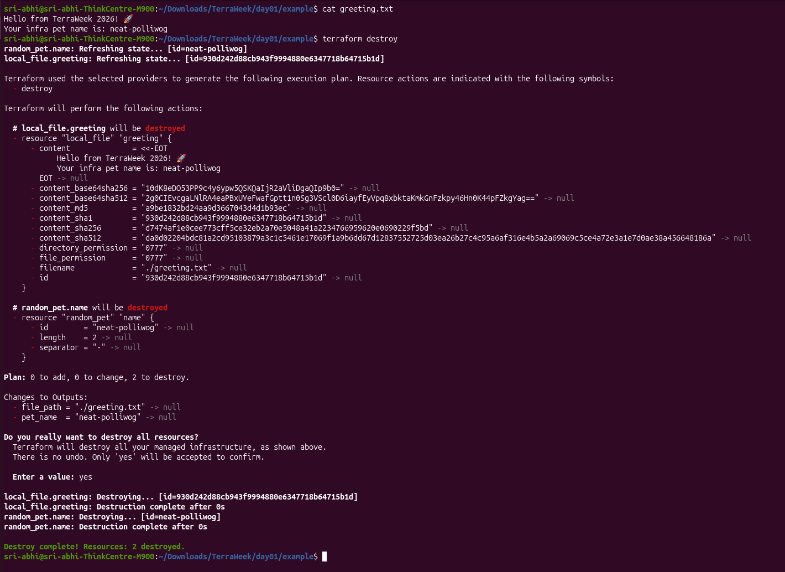

```
Plan: 0 to add, 0 to change, 2 to destroy.

Destroy complete! Resources: 2 destroyed.
```

**Key takeaway:** this confirms the exact official Day 1 exercise end to end — provider config with version constraints, resource interpolation between two resources, `output` blocks, and a full `init → validate → plan → apply → destroy` cycle.

---

## 12. OpenTofu — Quick Look

Briefly explored [OpenTofu](https://opentofu.org/), the open-source, Linux Foundation–governed fork of Terraform. It's a drop-in replacement — same HCL syntax, same core workflow (`init` → `plan` → `apply`), same `required_providers` / `provider` block structure.

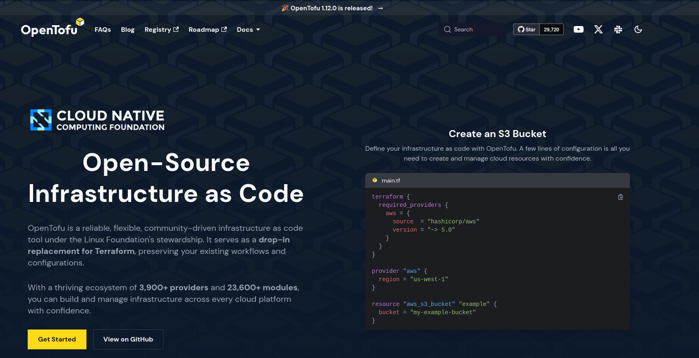

Day-to-day, the experience is nearly identical to Terraform — the main difference is who governs the project (community/Linux Foundation vs HashiCorp).

---

## 13. Bonus / Extra Exploration

- Set up tab completion for the CLI: `terraform -install-autocomplete`
- Explored `.terraform.lock.hcl` in depth (see section 9.5)
- Explored the `.terraform/providers/` cache structure in depth (see section 9.3)

---

## 14. Day 1 Wrap-Up

Foundations done:
- Understand what Terraform and IaC are, and why they matter
- Ran a full `init → validate → plan → apply → destroy` cycle with the `local` provider
- Set up the AWS provider, understood exactly how the provider binary gets downloaded and how it talks to AWS
- Installed and configured AWS CLI using a dedicated IAM user (not root)
- Understand the role of `.terraform/` vs `.terraform.lock.hcl` and why one is gitignored and the other isn't
- Ran the official TerraWeek Day 1 `example/` folder end to end, including `random_pet` interpolation and `output` blocks

Next up: Day 2.
